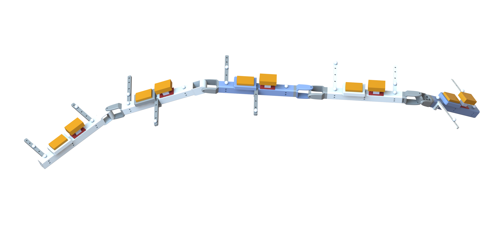

# DIODEM -- A <ins>D</ins>iverse <ins>I</ins>nertial and <ins>O</ins>ptical <ins>D</ins>ataset of Kin<ins>E</ins>matic chain <ins>M</ins>otion

This repository contains the source code of a Python Package (published on PyPI under `imt-diodem`) that allows for easy-access to the DIODEM dataset.

> **ℹ️ Installation:**
> 
> You can install with `pip install imt-diodem`.

> **ℹ️ Documentation:**
> 
> You can access the [Diodem Data Description](./docs/diodem.pdf) here.

The dataset files are hosted on Harvard Dataverse (https://doi.org/10.7910/DVN/SGJLZA). This Python Package then downloads the required dataset files from Dataverse on-demand.

## Quickstart
```python
import diodem

# concatenates 3 motions: the motion01, motion02 and motion03 
data = diodem.load_data(
    exp_id         = 1,
    motion_start   = 1,
    motion_stop    = 3,
    resample_to_hz = 100
)

print(data.keys())
# ['seg1', 'seg2', 'seg3', 'seg4', 'seg5']

print(data['seg1'].keys())
# ['imu_rigid', 'imu_nonrigid', 'marker1', 'marker2', 'marker3', 'marker4', 'quat']

print(data['seg1']['imu_rigid'].keys())
# ['acc', 'gyr', 'mag']
```
